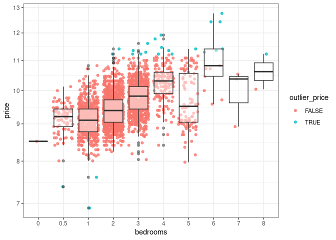
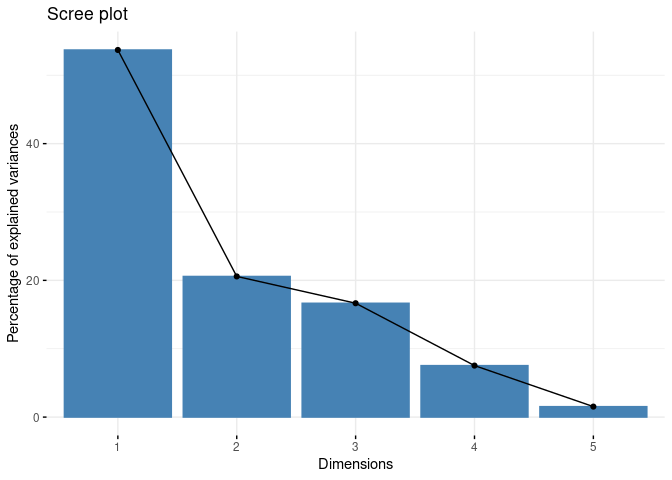
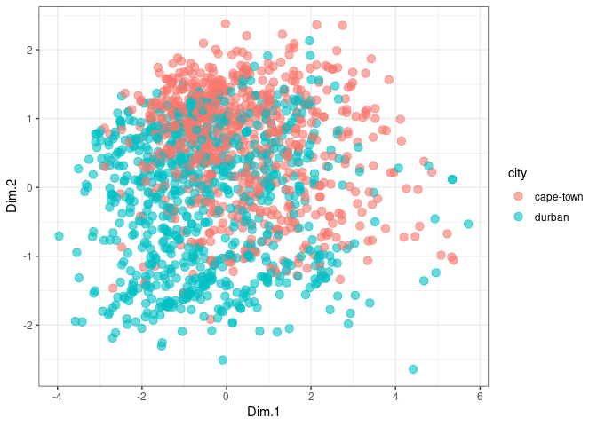

# README
Tivan

# Introduction

This document walks through the basic steps involved in principal
component analysis (PCA). It does so by using a specific example of
property data in South Africa.

# Packages

For this example I use the `factoextra` package for estimating the PCA
and `tidyverse` for reading data and feature engineering.

``` r
library(factoextra)
library(tidyverse)
```

# Data

For this example I use rental data in South Africa. This is merely for
illustrative purposes.

``` r
prop_data_raw <- read_delim("output/cop_property_data.csv", delim = "|")

prop_data_raw
```

    # A tibble: 10,302 × 8
       date       province      city   type  price deposit floor_size days_ad_active
       <date>     <chr>         <chr>  <chr> <dbl>   <dbl> <chr>               <dbl>
     1 2025-02-18 free-state    south… 3 Be…  5800    5800 151 m²                 31
     2 2025-02-18 gauteng       west-… 2 Be…  4650    4650 4 m²                   39
     3 2025-02-18 mpumalanga    midde… 3 Be… 14500   16000 137 m²                 36
     4 2025-02-18 north-west    potch… 2 Be… 10200   10200 79 m²                  39
     5 2025-02-18 kwazulu-natal kzn-m… 2 Be… 12500   12500 198 m²                 39
     6 2025-02-18 gauteng       centu… 3 Be… 17900   17900 160 m²                  9
     7 2025-02-18 free-state    north… 1.5 …  4500    5500 85 m²                  14
     8 2025-02-18 gauteng       east-… 3 Be… 14800   14800 156 m²                  7
     9 2025-02-18 gauteng       east-… 3 Be… 14800   14800 156 m²                  7
    10 2025-02-18 free-state    north… 3 Be…  8700   10700 360 m²                 39
    # ℹ 10,292 more rows

# Feature engineering

Now that the data has been read in, we can alter some of the columns to
make them more useful for our analysis. We extract the number of
bedrooms from the `type` variable with provides a brief description of
the type of property, extract the size of the property, and create a
variable that indicates the deposit as a percentage of rent.

``` r
prop_data_feat <- prop_data_raw %>% 
  # I want to keep only two provinces for illustrative purposes
  filter(province %in% c("western-cape", "kwazulu-natal")) %>% 
  mutate(
    # grab the digits at the start of the type variable (these are usually the
    # number of bedrooms)
    bedrooms = gsub(".*([0-9]+).*", "\\1", type),
    bedrooms = as.double(bedrooms),
    # in cases where there is an NA, and the ad says studio or bachelors, make
    # number of bedrooms 0.5
    bedrooms = case_when(
      !is.na(bedrooms) ~ bedrooms,
      grepl("([Bb]achelor)|([Ss]tudio)", type) ~ 0.5,
      T ~ NA_real_
    ),
    # extract the floor size and coerce to a double 
    size = gsub("([0-9]+).*", "\\1", floor_size),
    size = as.double(size),
    # derive a variable for the ratio of the deposit to the price
    deposit_prop = deposit/price
  ) %>% 
  # keep only the ones where we have a value for the number of bedrooms
  filter(!is.na(bedrooms)) 
```

    Warning: There was 1 warning in `mutate()`.
    ℹ In argument: `bedrooms = as.double(bedrooms)`.
    Caused by warning:
    ! NAs introduced by coercion

``` r
prop_data_feat
```

    # A tibble: 2,660 × 11
       date       province      city   type  price deposit floor_size days_ad_active
       <date>     <chr>         <chr>  <chr> <dbl>   <dbl> <chr>               <dbl>
     1 2025-02-18 kwazulu-natal kzn-m… 2 Be… 12500   12500 198 m²                 39
     2 2025-02-19 kwazulu-natal balli… 2 Be… 11000   11000 75 m²                  38
     3 2025-02-19 kwazulu-natal balli… 2 Be…  8500    8500 60 m²                  38
     4 2025-02-19 kwazulu-natal durban 5 Be… 40000   40000 350 m²                  6
     5 2025-02-19 kwazulu-natal durban 1 Be…  6700    6700 40 m²                  14
     6 2025-02-19 western-cape  garde… 3 Be… 14850   14850 180 m²                 38
     7 2025-02-19 kwazulu-natal balli… 2 Be… 13000   13000 77 m²                  24
     8 2025-02-19 western-cape  cape-… 1 Be… 25000   50000 69 m²                  37
     9 2025-02-19 western-cape  cape-… 1 Be… 22000   44000 97 m²                   3
    10 2025-02-19 western-cape  cape-… 2 Be… 38000   78000 69 m²                  23
    # ℹ 2,650 more rows
    # ℹ 3 more variables: bedrooms <dbl>, size <dbl>, deposit_prop <dbl>

# Outlier removal

``` r
prop_data_outliers <- prop_data_feat %>% 
  mutate(
    # log price and deposit
    across(
      price:deposit,
      ~log(.x)
    ),
    across(
      price:deposit,
      ~!between(
        .x,
        quantile(.x, 0.25) - (1.5 * IQR(.x)),
        quantile(.x, 0.75) + (1.5 * IQR(.x))
      ),
      .names = "outlier_{.col}"
    )
  )

prop_data_outliers
```

    # A tibble: 2,660 × 13
       date       province      city   type  price deposit floor_size days_ad_active
       <date>     <chr>         <chr>  <chr> <dbl>   <dbl> <chr>               <dbl>
     1 2025-02-18 kwazulu-natal kzn-m… 2 Be…  9.43    9.43 198 m²                 39
     2 2025-02-19 kwazulu-natal balli… 2 Be…  9.31    9.31 75 m²                  38
     3 2025-02-19 kwazulu-natal balli… 2 Be…  9.05    9.05 60 m²                  38
     4 2025-02-19 kwazulu-natal durban 5 Be… 10.6    10.6  350 m²                  6
     5 2025-02-19 kwazulu-natal durban 1 Be…  8.81    8.81 40 m²                  14
     6 2025-02-19 western-cape  garde… 3 Be…  9.61    9.61 180 m²                 38
     7 2025-02-19 kwazulu-natal balli… 2 Be…  9.47    9.47 77 m²                  24
     8 2025-02-19 western-cape  cape-… 1 Be… 10.1    10.8  69 m²                  37
     9 2025-02-19 western-cape  cape-… 1 Be… 10.0    10.7  97 m²                   3
    10 2025-02-19 western-cape  cape-… 2 Be… 10.5    11.3  69 m²                  23
    # ℹ 2,650 more rows
    # ℹ 5 more variables: bedrooms <dbl>, size <dbl>, deposit_prop <dbl>,
    #   outlier_price <lgl>, outlier_deposit <lgl>

After using the IQR x1.5 method for outlier removal, we visualise the
data to eyeball whether we are satisfied.

``` r
prop_data_outliers %>% 
  arrange(bedrooms) %>% 
  mutate(bedrooms = as_factor(bedrooms)) %>% 
  ggplot() +
  geom_jitter(
    aes(x = bedrooms, y = price, color = outlier_price),
    alpha = 0.8
  ) +
  geom_boxplot(
    aes(x = bedrooms, y = price),
    alpha = 0.5
  ) +
scale_y_continuous(trans = "log") +
  theme_bw()
```



Now that we are happy with the outlier that have been identified, we can
filter out those outliers and keep the columns that we need for
estimation.

``` r
prop_data <- prop_data_outliers %>% 
filter(
  !outlier_price,
  !outlier_deposit,
  bedrooms != 0, 
  bedrooms <= 4
) %>% 
  select(
    province,
    city,
    type,
    price,
    deposit,
    days_ad_active,
    bedrooms,
    size
  )

prop_data
```

    # A tibble: 2,503 × 8
       province      city          type  price deposit days_ad_active bedrooms  size
       <chr>         <chr>         <chr> <dbl>   <dbl>          <dbl>    <dbl> <dbl>
     1 kwazulu-natal kzn-midlands  2 Be…  9.43    9.43             39        2   198
     2 kwazulu-natal ballito-and-… 2 Be…  9.31    9.31             38        2    75
     3 kwazulu-natal ballito-and-… 2 Be…  9.05    9.05             38        2    60
     4 kwazulu-natal durban        1 Be…  8.81    8.81             14        1    40
     5 western-cape  garden-route  3 Be…  9.61    9.61             38        3   180
     6 kwazulu-natal ballito-and-… 2 Be…  9.47    9.47             24        2    77
     7 western-cape  cape-town     1 Be… 10.1    10.8              37        1    69
     8 western-cape  cape-town     1 Be… 10.0    10.7               3        1    97
     9 western-cape  cape-town     2 Be… 10.5    11.3              23        2    69
    10 western-cape  cape-town     3 Be… 10.9    11.5              37        3   126
    # ℹ 2,493 more rows

# Estimating the PCA

``` r
# estimate the pca
res.pca <- prop_data %>% 
  select(where(is.numeric)) %>% 
  prcomp(., scale = TRUE)

res.pca
```

    Standard deviations (1, .., p=5):
    [1] 1.6385648 1.0143104 0.9125574 0.6138285 0.2770081

    Rotation (n x k) = (5 x 5):
                         PC1        PC2        PC3          PC4         PC5
    price          0.5584210  0.1674390 -0.3313224  0.029878390  0.74125764
    deposit        0.5084633  0.2948795 -0.4688292  0.002727789 -0.65932006
    days_ad_active 0.0728025 -0.8999926 -0.4276102 -0.008343914 -0.04234448
    bedrooms       0.4564435 -0.2061169  0.5077212  0.694063362 -0.09833790
    size           0.4647474 -0.1803870  0.4793676 -0.719240064 -0.06611188

``` r
# Scree plot
fviz_eig(res.pca)
```



``` r
res.ind <- get_pca_ind(res.pca)

res.ind$coord %>% 
  as_tibble()
```

    # A tibble: 2,503 × 5
        Dim.1  Dim.2   Dim.3  Dim.4   Dim.5
        <dbl>  <dbl>   <dbl>  <dbl>   <dbl>
     1  0.146 -1.70  -0.0875 -0.793  0.0744
     2 -0.693 -1.48  -0.532   0.155  0.118 
     3 -1.21  -1.63  -0.289   0.257  0.0321
     4 -2.36   0.165  0.141  -0.362  0.147 
     5  0.853 -1.70   0.208   0.134  0.0448
     6 -0.480 -0.374 -0.258   0.159  0.225 
     7  0.648 -0.296 -2.57   -0.525 -0.101 
     8  0.378  1.96  -1.13   -0.728 -0.0558
     9  1.81   0.771 -2.07    0.284 -0.0324
    10  3.21  -0.359 -2.04    0.630  0.0444
    # ℹ 2,493 more rows

``` r
property_pca <- bind_cols(prop_data, res.ind$coord)

property_pca %>% 
  filter(city %in% c("durban", "cape-town")) %>%
  ggplot(
    aes(x = Dim.1, y = Dim.2, color = city)
  ) +
  geom_point(alpha = 0.6, size = 3) +
  theme_bw()
```


